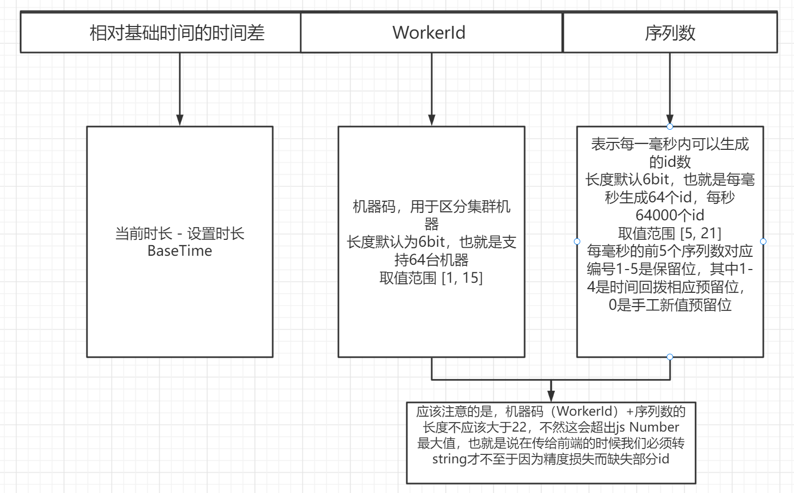

# 开箱即用的java雪花算法（yitter-idgenerator-spring-boot-starter）

### 1、介绍

雪花算法是一个分布式主键id生成的解决方案，他解决了分布式id生成的痛点问题，本算法基于推特雪花算法，进行深度优化。

算法基于[SnowFlake IdGenerator](https://gitee.com/yitter/idgenerator)核心代码开发，引入springboot自动配置，从而做到开箱即用的效果。该算法在缩短ID长度的同时，具备极高瞬时并发处理能力（50W/0.1s），且支持时间回拨。

**如果你觉得好用，请点一个star，这对我来说非常重要，谢谢！！！**


### 2、技术支持

本算法基于[多语言新雪花算法(SnowFlake IdGenerator)](https://gitee.com/yitter/idgenerator)核心代码实现，关于该算法更多细节请参阅项目地址。


### 3、算法特点

✔ 整形数字，随时间单调递增（不一定连续），长度更短，用50年都不会超过 js Number类型最大值。（默认配置）

✔ 速度更快，是传统雪花算法的2-5倍，0.1秒可生成50万个（基于8代低压i7）。

✔ 支持时间回拨处理。比如服务器时间回拨1秒，本算法能自动适应生成临界时间的唯一ID。

✔ 支持手工插入新ID。当业务需要在历史时间生成新ID时，用本算法的预留位能生成5000个每秒。

✔ 不依赖任何外部缓存和数据库。（k8s环境下自动注册 WorkerId 的动态库依赖 redis）

✔ 基础功能，开箱即用，无需配置文件、数据库连接等。

✔支持微服务动态配置，会动态加载单例bean，通过动态加载配置文件，而实现自动注册机器码。

✔支持数据中心id分配，更贴近实际生产环境。


### 4、如何使用

当然，我也为你准备了一个demo：[新型雪花算法微服务demo](https://gitee.com/lmlx66/hy-id-generator-demo)


#### 4.1、通用步骤


##### 4.1.1、引入相关maven

[maven仓库地址](https://repo1.maven.org/maven2/io/github/lmlx66/)

我们通过是否使用动态配置，是否使用mybatis-plus，分出了四个包，请你按需引入。


**1.假如你不需要使用动态配置，不需要整合mybatis-plus主键生成策略，则引入工件名：`yitter-idgenerator-spring-boot-starter`，示例如下：**

maven：

```xml
<dependency>
  <groupId>io.github.lmlx66</groupId>
  <artifactId>yitter-idgenerator-spring-boot-starter</artifactId>
  <version>1.1.0-RELEASE</version>
</dependency>
```

Gradle：

```gradle
implementation 'io.github.lmlx66:yitter-idgenerator-spring-boot-starter:1.1.0-RELEASE'
```


**2.不需要动态配置，需要mybatis-plus主键生成策略，则引入工件名：`yitter-idgenerator-mybatisPlus-spring-boot-starter`**

maven：

```xml
<dependency>
  <groupId>io.github.lmlx66</groupId>
  <artifactId>yitter-idgenerator-mybatisPlus-spring-boot-starter</artifactId>
  <version>1.1.0-RELEASE</version>
</dependency>
```

Gradle：

```gradle
implementation 'io.github.lmlx66:yitter-idgenerator-mybatisPlus-spring-boot-starter:1.1.0-RELEASE'
```


**3.需要动态配置，不需要mybatis-plus主键生成策略，则引入工件名：`yitter-idgenerator-spring-cloud-starter`**

maven：

```xml
<dependency>
  <groupId>io.github.lmlx66</groupId>
  <artifactId>yitter-idgenerator-spring-cloud-starter</artifactId>
  <version>1.1.0-RELEASE</version>
</dependency>
```

Gradle：

```gradle
implementation 'io.github.lmlx66:yitter-idgenerator-spring-cloud-starter:1.1.0-RELEASE'
```


**4..需要动态配置，需要mybatis-plus主键生成策略，则引入工件名：`yitter-idgenerator-mybatisPlus-spring-cloud-starter`**

maven：

```xml
<dependency>
  <groupId>io.github.lmlx66</groupId>
  <artifactId>yitter-idgenerator-mybatisPlus-spring-cloud-starter</artifactId>
  <version>1.1.0-RELEASE</version>
</dependency>
```

Gradle：

```gradle
implementation 'io.github.lmlx66:yitter-idgenerator-mybatisPlus-spring-cloud-starter:1.1.0-RELEASE'
```


##### 4.1.2、如何使用

注入生成器`WFGIdGenerator`并调用`next`方法，至于为什么是`WGF`呢？我网名叫`王富贵`

``` java
@RestController
public class IdController {
   
    @Autowired
    private WFGIdGenerator wFGIdGenerator;
    
    @GetMapping("getId")
    public long getId(){
        return wFGIdGenerator.next();
    } 
}
```

是不是非常简单呢？


##### 4.1.3、yaml配置

当然我们也可以对雪花算法简单的配置一下，yaml文件示例如下：

```yaml
wfg:
  method: 1 # 1为雪花漂移算法，2为传统算法
  worker-id: 2 # 机器码id
```


#### 4.2、整合mybatis-plus

如果你整合的是mybatis-plus版本，在实体类上使用注解`@TableId(value = "对应表字段名", type = IdType.ASSIGN_ID)`，则插入该字段为null会使用我们的雪花算法生成一个id。

其中重要的是`type`必须为`IdType.ASSIGN_ID`，如下所示：

```java
public class YourEntity {
    @TableId(value = "id", type = IdType.ASSIGN_ID)
    private String id;
}
```


### 5、配置详解


#### 5.1、配置文件配置

我们支持在yaml或者properties等配置文件中配置，注意前缀为`wfg`

| 参数名                | 默认值        | 作用                                            |
| --------------------- | ------------- | ----------------------------------------------- |
| Method（short）       | 1             | 1表示雪花漂移算法，2表示传统雪花算法            |
| BaseTime（long）      | 1640966400000 | 基础时间，为2022-01-01 00:00:00                 |
| DataCenterId          | 0             | 数据中心id                                      |
| DataCenterIdBitLength | 0             | 数据中心id位长，默认为0表示不开启数据中心id功能 |
| WorkerIdBitLength     | 1             | 机器码位长（能表示机器码的最大值）              |
| WorkerId              | 0             | 机器码（当前系统的机器码）                      |
| SeqBitLength          | 6             | 序列数位长（能表示机器码的最大序列数）          |
| MaxSeqNumber          | 0（不限制）   | 最大序列数（含）                                |
| MinSeqNumber          | 5（不限制）   | 最小序列数（含）                                |
| TopOverCostCount      | 2000          | 最大漂移次数，与计算能力有关                    |


#### 5.2、配置类配置

当然，我们也支持配置类配置，返回类型为WFGIdGenerator，其构造需要一个IdGeneratorProperties类型。

IdGeneratorProperties是基础配置类实体映射类，其内部属性即我们可配置的属性。

但请注意，如果配置类和配置文件（yaml或properties）同时使用，优先采用配置类配置。

```java
@Configuration
public class IdGeneratorConfig {
    @Bean
    public WFGIdGenerator wFGIdGenerator() {
         //准备基础配置类，在此可以配置基础信息
        IdGeneratorOptions idGeneratorOptions = new IdGeneratorOptions();
        idGeneratorOptions.setWorkerId((short) 6); //设置机器码为6
        idGeneratorOptions.setWorkerIdBitLength((byte) 3); //设置机器码位长为3
        //装载id生成器的配置文件
        return new wFGIdGenerator(idGeneratorOptions);
    }
}
```


##### 5.2.1、配置优先级

请注意我们的优先级，本地配置文件配置（本地yaml文件或properties文件） **<** 配置类配置（自己创建bean） **<** 配置中心配置（如nacos-config配置）

原因如下：配置中心配置修改时会重新加载bean


#### 5.3、参数详解

❄**Method**，表示使用什么算法，**默认值为1**，表示使用雪花漂移算法，2表示使用传统雪花算法。但仍建议你使用雪花漂移算法（Method=1，默认的），毕竟它具有更好的伸缩力和更高的性能。

❄ ***BaseTime***，基础时间（也称：基点时间、原点时间、纪元时间），默认值为：**2022-01-01 00:00:00**，是毫秒时间戳（是整数，.NET是DatetTime类型），作用是：用生成ID时的系统时间与基础时间的差值（毫秒数）作为生成ID的时间戳。基础时间一般无需设置，如果觉得默认值太老，你可以重新设置，不过要注意，这个值以后最好不变。

❄**DataCenterId**，  数据中心id，**默认值0**，必须 **全局唯一**（或相同 DataCenterId 内唯一），必须 **程序设定**，缺省条件（DataCenterIdBitLength取最大值6）时最大值63，表示支持63个数据中心。

❄**DataCenterIdBitLength**，数据中心位长，决定 DataCenterId 的最大值，**默认值为0**，表示不开启区分数据中心功能，取值范围[0,6]。

❄ **WorkerId**，机器码，**最重要参数**，**默认值0**，必须 **全局唯一**（或相同 DataCenterId 内唯一），必须 **程序设定**，缺省条件（WorkerIdBitLength取默认值）时最大值63，理论最大值 2^WorkerIdBitLength-1（不同实现语言可能会限定在 65535 或 32767，原理同 WorkerIdBitLength 规则）。不同机器或不同应用实例 **不能相同**，你可通过应用程序配置该值，也可通过调用外部服务获取值。针对自动注册WorkerId需求，本算法提供默认实现：通过 redis 自动注册 WorkerId 的动态库，详见“Tools\AutoRegisterWorkerId”。

❄ ***WorkerIdBitLength***，机器码位长，决定 WorkerId 的最大值，**默认值1**，取值范围 [1, 19]，实际上有些语言采用 无符号 ushort (uint16) 类型接收该参数，所以最大值是16，如果是采用 有符号 short (int16)，则最大值为15。

**特别提示**：如果一台服务器部署多个独立服务，需要为每个服务指定不同的 WorkerId。

❄ ***SeqBitLength***，序列数位长，**默认值6**，取值范围 [3, 21]（建议不小于4），决定每毫秒基础生成的ID个数。规则要求：WorkerIdBitLength + SeqBitLength + DataCenterIdBitLength <= 22。

❄ ***MinSeqNumber***，最小序列数，**默认值5**，取值范围 [5, MaxSeqNumber]，每毫秒的前5个序列数对应编号0-4是保留位，其中0是手工插入新值预留位，1-4是时间回拨相应预留位。

❄ ***MaxSeqNumber***，最大序列数，设置范围 [MinSeqNumber, 2^SeqBitLength-1]，**默认值0**，真实最大序列数取最大值（2^SeqBitLength-1），不为0时，取其为真实最大序列数，一般无需设置，除非多机共享WorkerId分段生成ID（此时还要正确设置最小序列数）。


tips：

``` java
关于规则：DataCenterIdBitLength + WorkerIdBitLength + SeqBitLength <= 22，我们id采用long基本类型，之所以定义是因为我们需要预留一些bit给毫秒数占位，因此，如果你需要线上使用，请计算清楚在你的需求下，该实例能跑多久。如果过于庞大，请使用String类型或者BigInteger类型重写。
```


#### 5.4、关于动态配置的问题


##### 5.4.1、动态加载配置

当你使用动态加载配置时，如果你在配置中心配置文件中注释掉了某个配置，他是不会恢复默认配置的，这和动态配置底层有关，这里就不过多描述。

因此，在你使用动态配置的时候，我们强烈建议将所有的配置都配置上去，并按需修改成你预期的配置，而不是注释掉，因为就算注释掉也不会再去使用默认配置了。

官方默认配置如下：

``` yaml
wfg:
# 请一定注意！ WorkerIdBitLength + SeqBitLength + DataCenterIdBitLength <= 22
  # 1表示雪花漂移算法，2表示传统雪花算法
  Method: 1
  # 基础时间，为2022-01-01 00:00:00
  baseTime: 1640966400000
  # 数据中心id
  DataCenterId: 0
  # 数据中心id位长，默认为0表示不开启数据中心id功能
  DataCenterIdBitLength: 0
  # 机器码（当前系统的机器码）
  WorkerId: 0
  # 机器码位长（能表示机器码的最大值）
  WorkerIdBitLength: 1
  # 序列数位长（能表示机器码的最大序列数）
  SeqBitLength: 6
  # 最大序列数（含）
  MinSeqNumber: 5
  # 最小序列数（含）
  MaxSeqNumber: 0
  # 最大漂移次数，与计算能力有关
  TopOverCostCount: 2000
```


##### 5.4.2、引入动态配置包报错

引入普通的依赖包不报错，但是很有可能引入动态配置包之后就报错了？

很大可能是 spring-boot 与 spring-cloud 版本不对应。

动态配置是依赖 spring-cloud 核心注解`@RefreshScope`实现的，因此我们引入了 `spring-cloud-context-3.1.2` 版本，但做过微服务的朋友都知道，spring-boot与spring-cloud版本需要高度对应，因此可能 `spring-cloud-context-3.1.2` 可能与你项目的 spring-boot 版本不对应，需移除旧版本，或引入与你 spring-boot 版本对应的 spring-cloud-context 版本

其二，我们由于自动配置在spring-2.7.0做出较大改变，因此暂时没有适配。如果您的spring版本为2.7.0，请降低spring版本使用。

### 6、其他细节


#### 6.1、id组成

- 本算法生成的ID由3部分组成（沿用雪花算法定义）：
- +---------------------------------------------------------------=------------------------+
- | 1.相对基础时间的时间差 | 2.DataCenterId数据中心id |3.WorkerId机器码 | 4.序列数 |
- +--------------------===-----------------------------------------------------------------+


当然下图并没有DataCenterId数据中心id，但其实类似于WorkerId的。




#### 6.2、异常处理

`IdGeneratorException`为此id生成器唯一且默认的异常类，他继承了`RuntimeException`，假如你需要捕获异常，请捕获它。


#### 6.3、集成算法

1️⃣ 用单例模式调用。外部集成方使用更多的实例并行调用本算法，不会增加ID产出效能，因为本算法采用单线程生成ID。

2️⃣ 指定唯一的 WorkerId。必须由外部系统确保 WorkerId 的全局唯一性，并赋值给本算法入口方法。

3️⃣ 单机多实例部署时使用不同 WorkerId。并非所有实现都支持跨进程的并发唯一，保险起见，在同一主机上部署多应用实例时，请确保各 WorkerId 唯一。

4️⃣ 异常处理。算法会抛出所有 Exception，外部系统应 catch 异常并做好应对处理，以免引发更大的系统崩溃。

5️⃣ 认真理解 IdGeneratorOptions 的定义，这对集成和使用本算法有帮助。

6️⃣ 使用雪花漂移算法。虽然代码里包含了传统雪花算法的定义，并且你可以在入口处指定（Method=2）来启用传统算法，但仍建议你使用雪花漂移算法（Method=1，默认的），毕竟它具有更好的伸缩力和更高的性能。

7️⃣ 不要修改核心算法。本算法内部参数较多，逻辑较为复杂，在你尚未掌握核心逻辑时，请勿修改核心代码且用于生产环境，除非通过大量细致、科学的测试验证。

8️⃣ 应用域内配置策略相同。当系统运行一段时间后，项目需要从程序指定 WorkerId 转到自动注册 WorkerId 时，请确保同一应用域内所有在用实例采用一致的配置策略，这不仅仅针对 WorkerId，也包含其他所有配置参数。

9️⃣ 管理好服务器时间。雪花算法依赖系统时间，不要手工大幅度回调操作系统时间。如果一定要调整，切记：确保服务再次启动时的系统时间大于最后一次关闭时的时间。（注：世界级或网络级的时间同步或回拨，引起的系统时间小幅度变化，对本算法没影响）


#### 6.4、配置变更

配置变更指是系统运行一段时间后，再调整运行参数（IdGeneratorOptions 选项值），请注意：

🔴 1.最重要的一条原则是：BaseTime **只能往前**（比老值更小、距离现在更远）赋值，原因是往后赋值极大可能产生相同的时间戳。[**不推荐**在系统运行之后调整 BaseTime]

🔴 2.任何时候增加 WorkerIdBitLength 或 SeqBitLength，都是可以的，但是慎用 “减小”的操作，因为这可能导致在未来某天生成的 ID 与过去老配置时相同。[允许在系统运行之后**增加**任何一个 BitLength 值]

🔴 3.如果必须减小 WorkerIdBitLength 或 SeqBitLength 其中的一项，一定要满足一个条件：新的两个 BitLength 之和要大于 老的值之和。[**不推荐**在运行之后缩小任何一个 BitLength 值]

🔴 4.上述3条规则，并未在本算法内做逻辑控制，集成方应根据上述规则做好影响评估，确认无误后，再实施配置变更。


#### 6.5、最佳实践

1. 机器码请务必唯一，我们可以使用redis自增结合nacos-config或其他方法进行自动配置。也可以使用该算法本身等特性进行k8s集成。
2. 序数位直接决定了本算法一毫秒内能够生成多少id，如果超过此数量，则会阻塞住。请务必测试好你的并发。
2. 本包支持动态配置加载bean，但我们强烈建议动态配置中心将所有配置都配置上，而不是不配置而使用默认。